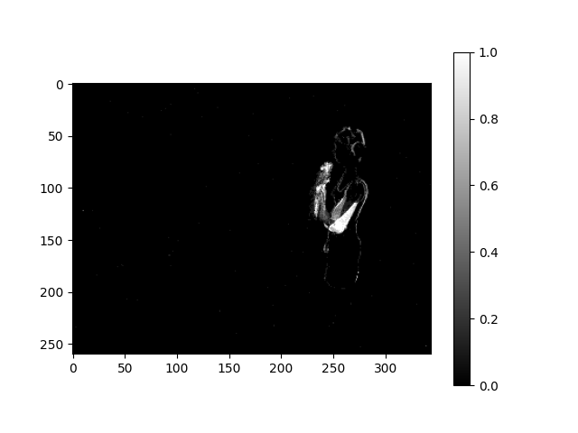
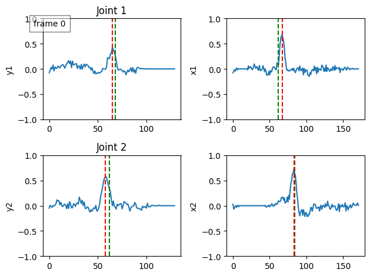
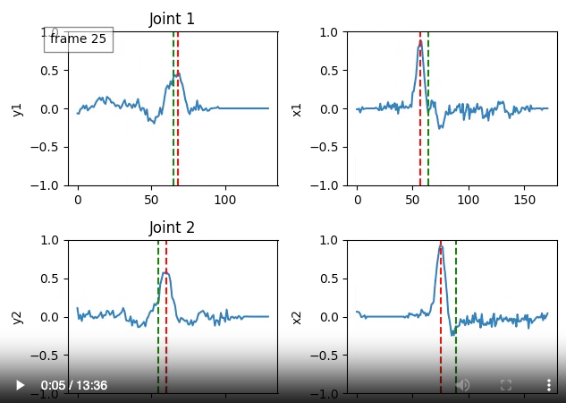
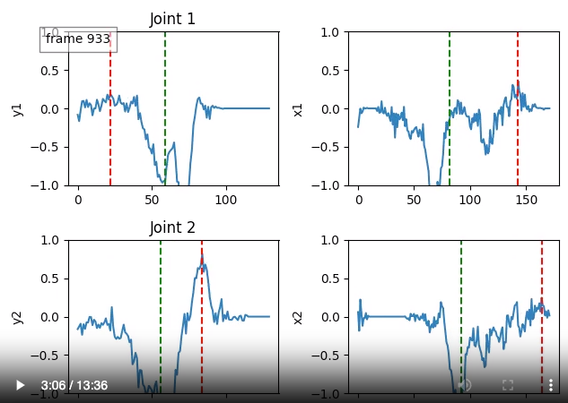
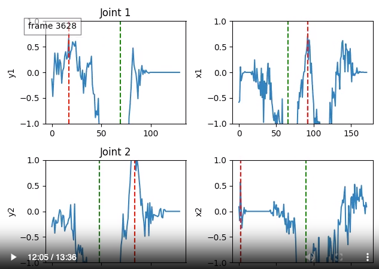

# DHP19 hand detection model evaluation
Evaluate DHP19 hand detection model running for a subject of the DHP19 dataset.

### Requirements
```bash
pip list | grep lava
pip list | grep nx
``` 
- lava-dl                   0.4.0
- lava-dnf                  0.1.4
- lava-loihi                0.5.0
- lava-nc                   0.8.0
- lava-optimization         0.3.0
- nxcore                    2.4.0

### DHP19 Data Subject 1
Download the .pkl files from <https://drive.switch.ch/index.php/s/Afbx4d00HM0ZRWy> and put into a folder `data/dhp19_samples`.
The .pkl files contain 4080 event-frames which are the models input stored as scipy.sparse.csr_matrix.

The content of `data/dhp19_samples/` should look like this.
```
dhp19_data_subject1_cam1.pkl
dhp19_data_subject1_cam2.pkl
```

The dataloader ` DHP19pklDataset()` returns those input frames (dense representation) `[344, 260, 1]` plus target vectors `[604]` and subject ID, movment ID and Session ID from the dataset.

Input sample:


### DHP19 Model
`model/train/$model_dir_XYZ/` holds the current DHP19 hand detection SDNN model(s)

### Running model inference in simulation
`eval_cpu` runs the model on the 4080 input frames for cam 1 or 2 and creates an annimation of the model outputs as .mp4 video, such that on can easily see how the model responded to which input frame. Further, the eucledean distance between prediction and target for both hands are recorded per frame/input and stord as .csv file.

Output sample:  
  
The x/y coordinates for each hand are predicted by the max() of the corresponding part of the output vector. In the example above, the red line indicates the max of the output (i.e. the predicted coordinate) and the green line is the respective target.

# The Issue
When running the model longer, the model outputs shift to unreasonable values. That means, in the beginning (first 100 frames) the model produces outputs that are expected such as in the example below for frame 25.
  
When showing more frames, the output values shift towards negativ values (even the model uses a ReLU at the output) and hence, the prediction becomes rather random. See for instance the output for frame 933.
This shift in the model output continous further to even more random values at the model output, i.e., for frame 3628.


This deterioration process can best be seen by the corresponding annimation of the output frames. Have a look on the .mp4 file here <https://drive.switch.ch/index.php/s/9AM877VHCdOtjqO>